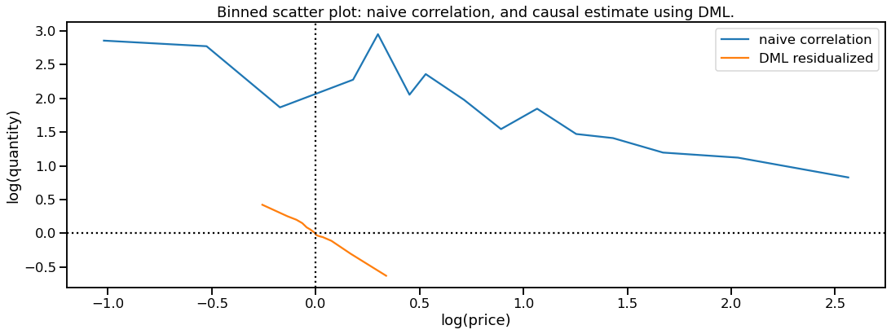

# Causal Inference in the Wild: Elasticity Pricing
This example gives a real-life example of causal inference in the wild. I use real ecommerce sales data and Double Machine Learning [1] to infer causal effects of price on quantity sold ("price elasticity of demand"). See the accompanying blogpost [TODO] for an easier-to-read version.

The plot below shows the main result: Double Machine Learning yields a beautifully observable estimate of elasticity, notably different from naive correlation.

## Getting started
- `environment.yml` describes a conda environment. Nothing too fancy, this should run under most standard Anaconda settings.
- `data_prep.ipynb` contains the data preparation steps. It is included only for completeness and to get a sense of real-world data; the output is a clean dataset in `econ_sample_clean.parquet`
- `elasticity_dml.ipynb` contains the main code, and many explanations for context.
- `models/` saves pre-trained RandomForest models (they get too large for github)

The project originally accompanies a workshop on causal inference for machine learners. Reach out if you are interested to learn more.

[1] Chernozhukov, Victor, et al.: Double/Debiased Machine Learning for Treatment and Structural Parameters. The Econometrics Journal, Volume 21, 2018. https://academic.oup.com/ectj/article/21/1/C1/5056401
